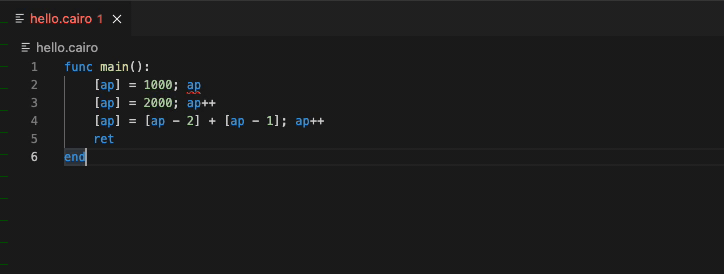

# Language support for Cairo

[Cairo](https://www.cairo-lang.org/) language support for VS Code.

This project implements a Cairo language server and VS Code extension to help with writing Cairo programs for StarkNet.

**Note**: This is an early preview release and is still in active development.

## Features

- Compiler support for Cairo .cairo files
- Live diagnostic highlighting for Cairo compile errors without needing to save the file
- Quick fixes with suggestions provided by Cairo compiler
- Hover documentation (minimal for now)
- Snippet insertion for Cairo templates (minimal for now)

Right-click menu commands to interact with Cairo:
- Compile Cairo program
- Run Cairo program

## Setup

1. Follow [Cairo environment setup steps](https://www.cairo-lang.org/docs/quickstart.html).
2. If using a virtual environment, start VS Code from within that terminal according to the instructions in the above link.
3. Install this extension along with [StarkWare's Cairo extension (.vsix file)](https://github.com/starkware-libs/cairo-lang/releases).
4. Open a .cairo file and start editing.
