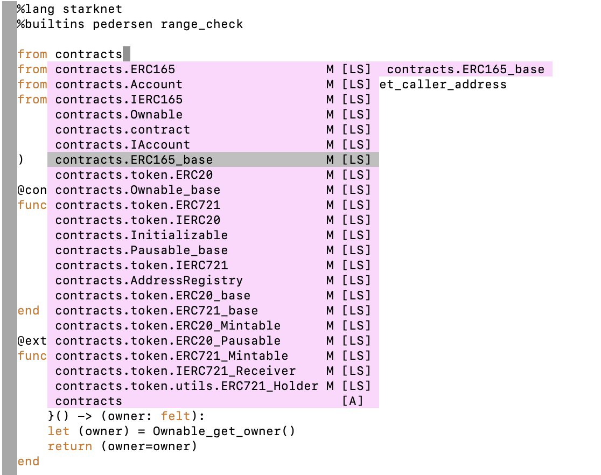

# Cairo Language Server for Vim

Code assistance when writing [Cairo](https://www.cairo-lang.org/) smart contracts for StarkNet.

Makes use of the [Cairo Language Server](https://github.com/ericglau/cairo-ls).

**Note**: This is an early preview and is still in active development.



## Features

- Compiler support for .cairo files
- Live diagnostic highlighting for compile errors
- Quick fixes with suggestions provided by Cairo/StarkNet compiler
- Go to definitions for imports
- Code completion for imports

## Setup

1. Install [Coc](https://github.com/neoclide/coc.nvim)

2. Install [coc-cairo](https://github.com/kevinhalliday/coc-cairo)

3. Add the following to `~/.vimrc`
```
au BufReadPost *.cairo set filetype=cairo
au Filetype cairo set syntax=cairo
```

4. Add [Coc's example Vim configuration](https://github.com/neoclide/coc.nvim#example-vim-configuration) to `~/.vimrc`

5. Install Nile by following its [Getting started](https://github.com/OpenZeppelin/nile#getting-started) steps, or follow the [Cairo environment setup steps](https://www.cairo-lang.org/docs/quickstart.html).

6. For syntax highlighting, download https://github.com/starkware-libs/cairo-lang/blob/master/src/starkware/cairo/lang/ide/vim/syntax/cairo.vim to `~/.vim/syntax/`

7. Use Vim to open a `.cairo` file.
